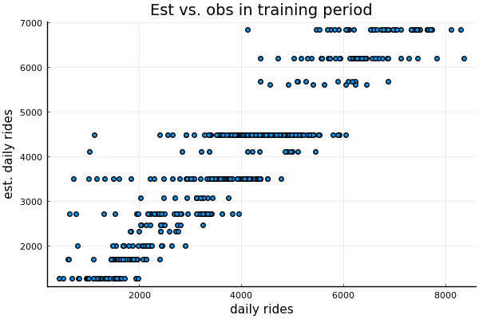
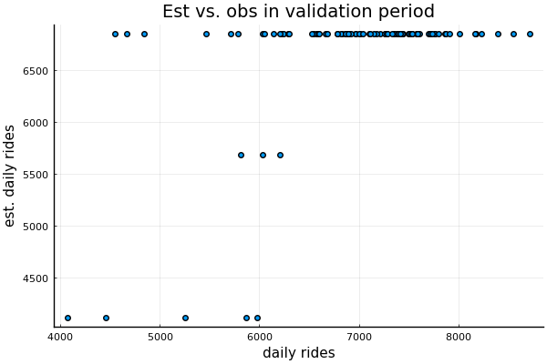
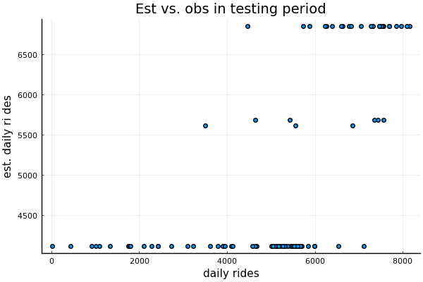

```@meta
EditURL = "<unknown>/bike_sharing.jl"
```

# Bike sharing demand forecast (on daily data)

Predict bike sharing demand as a function of seasonal and weather
conditions.

Data origin:
- original full dataset (by hour, not used here): https://archive.ics.uci.edu/ml/datasets/Bike+Sharing+Dataset
- simplified dataset (by day, with some simple scaling): https://www.hds.utc.fr/~tdenoeux/dokuwiki/en/aec
   - description: https://www.hds.utc.fr/~tdenoeux/dokuwiki/_media/en/exam_2019_ace_.pdf
   - data: https://www.hds.utc.fr/~tdenoeux/dokuwiki/_media/en/bike_sharing_day.csv.zip

Note that even if we are estimating a time serie, we are not using
here a recurrent neural network as we assume the temporal dependence
to be negligible (i.e. Y_t = f(X_t) alone).

```julia
using Pkg
Pkg.activate(@__DIR__)
Pkg.instantiate()

import Random
Random.seed!(123);
nothing #hide
```

```
 Activating environment at `~/Dropbox/Julia7/MLJ/MLJ/sandbox/betaml/Project.toml`

```

Loading cleaned version of the data:

```julia
using UrlDownload, ZipFile, PooledArrays, DataFrames, CSV
location = "https://www.hds.utc.fr/~tdenoeux/"*
    "dokuwiki/_media/en/bike_sharing_day.csv.zip"
data = DataFrame(urldownload(location));
describe(data)
```

```
16×7 DataFrame
 Row │ variable    mean       min         median    max         nmissing  eltype
     │ Symbol      Union…     Any         Union…    Any         Int64     DataType
─────┼─────────────────────────────────────────────────────────────────────────────
   1 │ instant     366.0      1           366.0     731                0  Int64
   2 │ dteday                 2011-01-01            2012-12-31         0  Date
   3 │ season      2.49658    1           3.0       4                  0  Int64
   4 │ yr          0.500684   0           1.0       1                  0  Int64
   5 │ mnth        6.51984    1           7.0       12                 0  Int64
   6 │ holiday     0.0287278  0           0.0       1                  0  Int64
   7 │ weekday     2.99726    0           3.0       6                  0  Int64
   8 │ workingday  0.683995   0           1.0       1                  0  Int64
   9 │ weathersit  1.39535    1           1.0       3                  0  Int64
  10 │ temp        0.495385   0.0591304   0.498333  0.861667           0  Float64
  11 │ atemp       0.474354   0.0790696   0.486733  0.840896           0  Float64
  12 │ hum         0.627894   0.0         0.626667  0.9725             0  Float64
  13 │ windspeed   0.190486   0.0223917   0.180975  0.507463           0  Float64
  14 │ casual      848.176    2           713.0     3410               0  Int64
  15 │ registered  3656.17    20          3662.0    6946               0  Int64
  16 │ cnt         4504.35    22          4548.0    8714               0  Int64
```

The target `y` is the `:cnt` column. The features, `x`, are to include everything that's left, excluding `:dteday`, `:casual`, and `:registered`:

```julia
using MLJ
y, x = unpack(data,
              ==(:cnt),
              name -> !(name in [:dteday, :casual, :registered]));
nothing #hide
```

Inspecting the interpretation of the data as currently represented:

```julia
schema(x)
```

```
┌────────────┬─────────┬────────────┐
│ _.names    │ _.types │ _.scitypes │
├────────────┼─────────┼────────────┤
│ instant    │ Int64   │ Count      │
│ season     │ Int64   │ Count      │
│ yr         │ Int64   │ Count      │
│ mnth       │ Int64   │ Count      │
│ holiday    │ Int64   │ Count      │
│ weekday    │ Int64   │ Count      │
│ workingday │ Int64   │ Count      │
│ weathersit │ Int64   │ Count      │
│ temp       │ Float64 │ Continuous │
│ atemp      │ Float64 │ Continuous │
│ hum        │ Float64 │ Continuous │
│ windspeed  │ Float64 │ Continuous │
└────────────┴─────────┴────────────┘
_.nrows = 731

```

```julia
scitype(y)
```

```
AbstractArray{Count,1}
```

Coercing type of `y` to get appropriate interpretation:

```julia
y = coerce(y, Continuous);
nothing #hide
```

Optional: look for all supervised models that apply to this data:

```julia
models(matching(x, y))
```

```
5-element Array{NamedTuple{(:name, :package_name, :is_supervised, :docstring, :hyperparameter_ranges, :hyperparameter_types, :hyperparameters, :implemented_methods, :is_pure_julia, :is_wrapper, :load_path, :package_license, :package_url, :package_uuid, :prediction_type, :supports_online, :supports_weights, :input_scitype, :target_scitype, :output_scitype),T} where T<:Tuple,1}:
 (name = ConstantRegressor, package_name = MLJModels, ... )
 (name = DecisionTreeRegressor, package_name = DecisionTree, ... )
 (name = DeterministicConstantRegressor, package_name = MLJModels, ... )
 (name = RandomForestRegressor, package_name = DecisionTree, ... )
 (name = RandomForestRegressor, package_name = ScikitLearn, ... )
```

Splitting the data into train, validation and test sets:

```julia
train, val, test = partition(eachindex(y), 0.75, 0.125);
xtrain    = x[train, :]
ytrain    = y[train]
xval      = x[val, :]
yval      = y[val]
xtest     = x[test, :]
ytest     = y[test];
nothing #hide
```

## Decision Trees

Loading the model code (a default instance is returned):

```julia
tree_model = @load DecisionTreeRegressor pkg=DecisionTree
```

```
DecisionTreeRegressor(
    max_depth = -1,
    min_samples_leaf = 5,
    min_samples_split = 2,
    min_purity_increase = 0.0,
    n_subfeatures = 0,
    post_prune = false,
    merge_purity_threshold = 1.0) @544
```

Note that a model is just a struct containing hyperparameters. The
learned parameters (in this case a tree) called `tree` below.

### Tuning `max_depth` (by hand, using a holdout set - no cross validation)

```julia
function findBestDepth(xtrain, ytrain, xval, yval, attemptedDepths)
    best_depth = 1
    best_error   = +Inf
    for ad in attemptedDepths
        tree_model.max_depth = ad
        tree, _ = MLJ.fit(tree_model, 0, xtrain, ytrain) # verbosity=0
        ŷval   = MLJ.predict(tree_model, tree, xval)
        mean_proportional_error = mape(ŷval, yval)
        println("$ad : $mean_proportional_error")
        if mean_proportional_error < best_error
            best_depth = ad
            best_error   = mean_proportional_error
        end
    end
    return (best_depth, best_error)
end
```

```
findBestDepth (generic function with 1 method)
```

```julia
best_depth, best_error = findBestDepth(xtrain, ytrain, xval, yval, 1:20)
```

```
(4, 0.09823897896834381)
```

Re-training the best model on the train set:

```julia
model = DecisionTreeRegressor(max_depth=best_depth)
tree, _ = MLJ.fit(model, 1, xtrain, ytrain)
```

```
(Decision Tree
Leaves: 15
Depth:  4, nothing, nothing)
```

```julia
ŷtrain = MLJ.predict(model, tree, xtrain)
ŷval   = MLJ.predict(model, tree, xval)
ŷtest  = MLJ.predict(model, tree, xtest);
nothing #hide
```

```julia
@show mape(ŷtrain, ytrain) mape(ŷval, yval) mape(ŷtest, ytest)
```

```
2.4716626026894897
```

```julia
using StatsPlots
pyplot()
```

```
Plots.PyPlotBackend()
```

```julia
scatter(ytrain,
        ŷtrain,
        xlabel="daily rides",
        ylabel="est. daily rides",
        label=nothing,
        title="Est vs. obs in training period")
```


```julia
scatter(yval,ŷval,
        xlabel="daily rides",
        ylabel="est. daily rides",
        label=nothing,
        title="Est vs. obs in validation period")
```


```julia
scatter(ytest,
        ŷtest,
        xlabel="daily rides",
        ylabel="est. daily ri des",
        label=nothing,
        title="Est vs. obs in testing period")
```


---

*This page was generated using [Literate.jl](https://github.com/fredrikekre/Literate.jl).*

